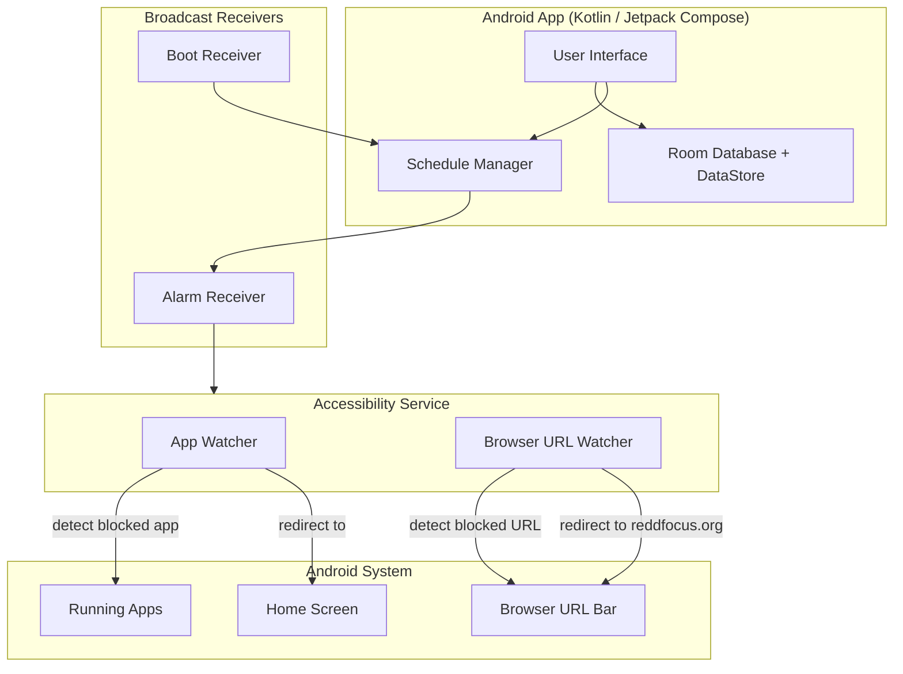

**ARCHIVED:** Now moved into https://github.com/ulyngs/digital-habits-blocker

# ReDD Blocker Android (Beta)

Block distracting websites and apps with scheduled or one-off blocks. Stay focused on what matters.

Built by computer scientists at the University of Oxford (Dr Ulrik Lyngs) and the University of Maastricht (Dr Konrad Kollnig), as part of the Reduce Digital Distraction project ([reddfocus.org](https://reddfocus.org)).

## Features

- **App Blocking** — Detects blocked apps via Accessibility Service and returns you to the home screen
- **Website Blocking** — Blocks websites in Firefox, Chrome, Brave, and other Chromium-based browsers
- **Flexible Blocklists** — Create multiple schedules with custom sets of blocked apps and websites
- **One-Off Blocks** — Quick blocks for immediate focus sessions
- **Scheduled Blocks** — Set recurring blocks on specific days/times (e.g., block social media Mon–Fri 9am–5pm)
- **Override Protection** — Configurable word-entry friction prevents impulsive unblocking
- **Boot Persistence** — Schedules resume automatically after device restart
- **Material You** — Modern Material 3 design with dynamic colors

## Architecture



## How It Works

### App Blocking

ReDD Blocker uses Android's Accessibility Service to monitor which app is in the foreground. When a blocked app is detected, the user is immediately returned to the home screen.

| Component | Role |
|-----------|------|
| Accessibility Service | Detects foreground app changes via `onAccessibilityEvent` |
| Home redirect | Launches the default launcher intent to return user to home screen |

### Website Blocking

The Accessibility Service also monitors the URL bar of supported browsers. When a blocked domain is detected, the browser is redirected to `reddfocus.org`.

| Browser | Support |
|---------|---------|
| Firefox | ✅ URL bar monitoring via Accessibility |
| Chrome  | ✅ URL bar monitoring via Accessibility |
| Brave   | ✅ URL bar monitoring via Accessibility |
| Other Chromium-based | ✅ URL bar monitoring via Accessibility |

### Schedule Management

Schedules define which apps and websites are blocked and when. Each schedule can be configured with:

- **Manual activation** — Start/stop blocks on demand
- **Daily schedule** — Block during specific hours every day
- **Weekly schedule** — Block during specific hours on selected days
- **Override friction** — Require typing a configurable number of random words before disabling

Schedules are persisted via Room database and survive app restarts. A boot receiver re-registers alarms on device restart.

## Permissions

| Permission | Purpose |
|------------|---------|
| Accessibility Service | **Required.** Detects app launches and browser URL navigation |
| Notifications | Shows alerts when content is blocked |
| Battery Optimization Exemption | Ensures reliable background operation |
| Receive Boot Completed | Restores schedules after device restart |

## Project Structure

```
ReDDBlockAndroid/
├── app/src/main/
│   ├── AndroidManifest.xml           # App manifest & permissions
│   └── java/net/kollnig/reddblockandroid/
│       ├── MainActivity.kt           # Main entry point
│       ├── ReDDBlockApp.kt           # Application class
│       ├── data/                     # Room database & data models
│       ├── receiver/                 # Boot & alarm broadcast receivers
│       ├── schedule/                 # Schedule management logic
│       ├── service/                  # Accessibility service
│       ├── ui/                       # Jetpack Compose UI screens
│       └── util/                     # Utility functions
├── build.gradle                      # Project-level build config
├── app/build.gradle                  # App-level build config & dependencies
├── gradle/                           # Gradle wrapper
└── settings.gradle                   # Project settings
```

## Local Development

### Prerequisites

- [Android Studio](https://developer.android.com/studio) (latest stable)
- JDK 17+
- Android SDK 34+

### Getting Started

```bash
# Clone the repository
git clone <repo-url>
cd ReDDBlockAndroid

# Build debug APK
./gradlew assembleDebug

# Install on connected device
./gradlew installDebug
```

Or open the project in Android Studio and run directly on a connected device or emulator.

### Building

```bash
# Debug build
./gradlew assembleDebug

# Release build
./gradlew assembleRelease
```

## Requirements

- **Android**: 7.0+ (API 24, Nougat or later)

## Acknowledgments

This project is based on [Reef](https://github.com/aload0/Reef) by Pranav Purwar, licensed under the MIT License.

## License

MIT

---

Made with ♥ by [reddfocus.org](https://reddfocus.org)
